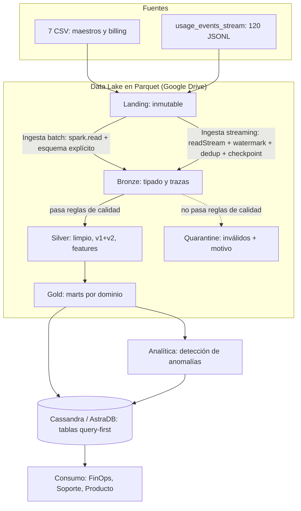

# Cloud Provider Analytics — Documento de diseño v1.0

**Plataforma de datos para FinOps, Soporte y Producto**
**Fase 1: diseño de arquitectura y fundación de datos**

| Campo | Detalle |
|---|---|
| Preparado por | Equipo de Datos · Victoria Acu{a} |
| Preparado para | Áreas de FinOps, Soporte y Producto |
| Versión | 1.0 |
| Fecha | 07/10/2026 |
| Estado | Para revisión |
| Contexto académico | Proyecto Integrador · Minería de Datos II · ISTEA · 2C 2026 · Prof. Diego Mosquera |

---

## Resumen ejecutivo

El área de datos propone una plataforma que integra la información de clientes, uso, facturación y soporte del proveedor, hoy dispersa en archivos crudos con problemas de calidad. La plataforma combina un camino de procesamiento **casi en tiempo real**, para el seguimiento del costo de uso, con un camino **batch**, para maestros y facturación (arquitectura Lambda). Los datos se organizan en un Data Lake por zonas de calidad creciente (Landing, Bronze, Silver y Gold) y se publican en Cassandra para consultas de baja latencia.

El perfilado inicial de las fuentes identificó hallazgos con impacto directo en el negocio. Los más relevantes son un **tipo de cambio inconsistente en las 160 facturas en USD**, que introduciría hasta un 15 % de error en el revenue, **216 eventos con costo negativo** y **picos de costo de hasta 19 veces el percentil 99**. El diseño incorpora reglas de calidad, una zona de cuarentena y controles de trazabilidad para que ninguna de estas situaciones llegue a los tableros sin tratamiento.

Este documento presenta el diseño propuesto, la evidencia que lo respalda y el plan de implementación en tres fases.

---

## Índice

1. Problema, usuarios y objetivos
2. Justificación de una solución Big Data: las 5V
3. Inventario y perfil de las fuentes
4. Arquitectura de alto nivel (v1)
5. Patrón arquitectónico
6. Matriz requisito-componente
7. Diseño del Data Lake
8. Flujos de datos batch y streaming
9. Flujo batch de referencia en lógica MapReduce
10. Supuestos, riesgos, mitigaciones y decisiones abiertas
11. Esfuerzo, roles y recursos
12. Repositorio y evidencia de exploración
13. Plan de ajustes posterior a la revisión
14. Documentación de soporte

---

## 1. Problema, usuarios y objetivos

### 1.1 Problema

Los datos de clientes, uso, facturación y soporte llegan crudos, con nulos, tipos ambiguos, valores anómalos y un cambio de esquema a mitad del histórico. En este estado no pueden consumirse con confianza. El área de datos debe ingestarlos, limpiarlos, conformarlos y publicarlos para tres áreas usuarias, con dos necesidades de latencia distintas:

- **Casi en tiempo real**, para las métricas operativas de uso y costo incremental.
- **Batch diario o mensual**, para los maestros de CRM, la facturación y las fuentes de referencia.

### 1.2 Usuarios, preguntas y objetivos medibles

Las preguntas se priorizaron con las áreas usuarias y definen el alcance del producto mínimo viable.

| Usuario | Pregunta de negocio | Objetivo medible |
|---|---|---|
| FinOps | ¿Cuánto gasta cada organización por día y por servicio? | Costos y requests diarios por org y servicio, para un rango de fechas, consultables desde Cassandra |
| FinOps | ¿Qué servicios concentran el costo de cada organización? | Top-N de servicios por costo acumulado en los últimos 14 días, recalculado diariamente |
| FinOps | ¿Cuánto factura cada organización por mes? | Revenue mensual de los 3 meses disponibles (jun-ago 2025), con créditos e impuestos, normalizado a USD |
| FinOps | ¿Existen gastos anómalos? | 100 % de los eventos evaluados por una regla de anomalía y marcados con un flag |
| Soporte | ¿Cómo evolucionan los tickets críticos y el incumplimiento de SLA? | Tasa diaria de SLA breach de los últimos 30 días, por organización |
| Producto | ¿Cuánto consume cada organización en GenAI? | Tokens y costo estimado por día, desde la aparición del dato (schema v2) |
| Transversal | ¿Son confiables los datos publicados? | 0 duplicados por `event_id`; 100 % de los registros inválidos aislados en cuarentena con su motivo |

---

## 2. Justificación de una solución Big Data: las 5V

| V | Evidencia en el caso | Decisión de arquitectura asociada |
|---|---|---|
| **Volumen** | 43.200 eventos en 120 archivos (~13 MB). La muestra es reducida, pero representa a un proveedor cuyos eventos de uso crecen de forma sostenida | Procesamiento distribuido con Spark; Parquet columnar; particionado por fecha |
| **Velocidad** | Los eventos llegan fragmentados en micro-lotes (360 eventos por archivo) y FinOps requiere costos casi en tiempo real | Structured Streaming con watermark y checkpointing |
| **Variedad** | Dos capas: entre fuentes (7 CSV + JSONL) y dentro de una misma fuente en el tiempo (evolución v1 → v2 con `carbon_kg` y `genai_tokens`) | Esquemas explícitos por fuente; unificación v1/v2 en Silver |
| **Veracidad** | `value` y `timestamp` llegan como texto; 216 costos negativos; picos de hasta 317 USD; tipo de cambio inconsistente en facturas USD; JSON malformado | Reglas de calidad, cuarentena y flags de anomalía |
| **Valor** | Control de costos (FinOps), cumplimiento de SLA (Soporte) y adopción de GenAI (Producto) | Marts Gold por dominio servidos en Cassandra/AstraDB |

**V predominante: Variedad**, estrechamente ligada a Veracidad. La variedad más exigente no es la diferencia entre formatos, sino el cambio de esquema dentro de la fuente de eventos, que obliga a compatibilizar versiones sin perder información.

**Nota sobre el volumen.** El dataset disponible es reducido y podría procesarse en una sola máquina con pandas, que para volúmenes chicos resulta más simple y rápido que una herramienta distribuida. Adoptar Spark sin necesidad real solo agregaría complejidad. Sin embargo, la muestra representa a un proveedor de nube cuyos eventos de uso crecen de forma sostenida y que requiere pipelines repetibles, particionados y con procesamiento tanto batch como streaming. Es ese escenario productivo, y no el tamaño de la muestra, el que justifica la elección de Spark (ver D-03 en `DECISIONS.md`).

---

## 3. Inventario y perfil de las fuentes

Evidencia: `notebooks/01_exploracion_landing.ipynb`.

### 3.1 Inventario

| Fuente | Grano (1 fila = …) | Clave | Filas | Frecuencia (supuesto) | Calidad observada | Riesgo |
|---|---|---|---|---|---|---|
| customers_orgs.csv | 1 organización | `org_id` | 80 | Batch diario | `nps_score`: 11 nulos y 1 valor fuera de rango (101) | Medio |
| users.csv | 1 usuario | `user_id` | 800 | Batch diario | `last_login`: 139 nulos (usuarios sin acceso; esperable) | Bajo |
| resources.csv | 1 recurso cloud | `resource_id` | 400 | Batch diario | `tags_json`: 83 nulos y JSON malformado | Medio |
| support_tickets.csv | 1 ticket | `ticket_id` | 1.000 | Batch diario | `resolved_at`: 240 nulos (tickets abiertos); `csat`: 254 nulos | Medio |
| marketing_touches.csv | 1 interacción | `touch_id` | 1.500 | Batch diario | Sin nulos | Bajo |
| nps_surveys.csv | 1 encuesta de una org en una fecha | `org_id` + `survey_date` | 92 | Batch periódico | `nps_score`: 19 nulos; valores en rango | Medio |
| billing_monthly.csv | 1 factura de una org en un mes | `invoice_id` | 240 | Batch mensual | `credits`: 137 nulos; tipo de cambio ≠ 1 en facturas USD; multimoneda | **Alto** |
| usage_events_stream/*.jsonl | 1 medición de uso de un recurso | `event_id` | 43.200 | Streaming (micro-lotes) | `value` y `timestamp` como texto; `unit`: 2.075 nulos; `value`: 877 nulos; esquema v1/v2 | **Alto** |

### 3.2 Hallazgos verificados

**Eventos**

- Período cubierto: del 03/07/2025 al 31/08/2025 (60 días), con 720 eventos por día.
- Evolución de esquema: 10.800 eventos v1 (15 días, hasta el 17/07) y 32.400 eventos v2 (45 días, desde el 18/07). Los 10.800 nulos de `carbon_kg` coinciden exactamente con los eventos v1, lo que confirma que el campo solo existe en v2.
- `genai_tokens` está presente en 3.132 eventos, todos del servicio `genai` en v2 (el servicio registra 4.158 eventos en total).
- `event_id`: 0 duplicados en Landing.
- `timestamp`: el 100 % se convierte correctamente a tipo fecha-hora.
- `value`: inferido como texto por mezclar números con y sin comillas en el JSON; el 100 % de los valores no nulos es convertible a número.
- `cost_usd_increment`: mediana 1,00 USD, percentil 99 de 16,72 USD, máximo 317,43 USD (19 veces el p99) y 216 valores negativos (0,5 %).
- Dominios categóricos limpios: 7 regiones (`ap-northeast`, `us-east`, `us-west`, `sa-east`, `ap-south`, `eu-west`, `eu-central`), coincidentes con `hq_region` del maestro de clientes, y 6 servicios (`compute`, `storage`, `database`, `networking`, `analytics`, `genai`), sin variantes de escritura.

**Maestros**

- `nps_score` se encuentra en **escala agregada (-100 a 100)**, verificado por su distribución: rango de -38 a 101 en clientes y de -16 a 68 en encuestas. El único valor imposible es 101.
- `billing_monthly` está completo: 80 organizaciones × 3 meses = 240 facturas.
- Tipo de cambio a USD por moneda: ARS entre 0,00133 y 0,00162 y EUR entre 0,998 y 1,198, ambos razonables; **USD entre 0,855 y 1,118, inconsistente**, ya que la conversión de USD a USD debe ser 1.

### 3.3 Trazabilidad

Cada registro de Bronze incorporará las columnas técnicas `ingest_ts` (momento de ingesta) y `source_file` (archivo de origen), junto con `run_id` (ejecución que lo procesó) y, en eventos, `schema_version`. Estas columnas permiten rastrear cualquier dato publicado hasta el archivo de Landing que le dio origen, con tres usos concretos:

- **Auditoría:** responder de dónde proviene una cifra publicada en un mart.
- **Reprocesamiento selectivo:** si un archivo llega corrupto o incompleto, identificar y reprocesar solo los registros afectados, sin recargar todo el histórico.
- **Diagnóstico de calidad:** detectar si los registros enviados a cuarentena se concentran en determinados archivos o ejecuciones, lo que indicaría un problema en el origen y no en los datos individuales.

---

## 4. Arquitectura de alto nivel (v1)

Versión gráfica: `docs/arquitectura_v1.png` (fuente editable: `docs/arquitectura_v1.drawio`).



**Capacidades transversales:** calidad, metadatos, linaje, seguridad y observabilidad, aplicadas a todas las zonas.

| Componente | Responsabilidad |
|---|---|
| Fuentes | Archivos CSV (batch) y JSONL (streaming) de los sistemas de origen |
| Ingesta batch | Lectura con esquema explícito, columnas técnicas y deduplicación |
| Ingesta streaming | Lectura incremental, watermark, deduplicación por `event_id` y checkpointing |
| Data Lake | Almacenamiento por zonas con promoción controlada (sección 7) |
| Analítica | Detección de anomalías de costo sobre datos conformados |
| Serving | Tablas modeladas según las consultas de negocio, cargadas desde Spark |
| Consumo | Herramientas de visualización de FinOps, Soporte y Producto |

---

## 5. Patrón arquitectónico

**Patrón elegido: Lambda.** Un camino batch para maestros, facturación y encuestas, y un camino streaming para los eventos de uso, que convergen en la capa Gold y en el serving.

**Justificación:**

1. **Las fuentes tienen ritmos de llegada distintos.** Los eventos de uso se generan de forma continua (720 por día), mientras que la facturación tiene granularidad mensual (una factura por organización por mes, siempre fechada el día 1) y los maestros cambian con baja frecuencia. Tratar todas las fuentes como streams agregaría complejidad sin beneficio; tratarlas todas en batch eliminaría la visibilidad casi en tiempo real del gasto que necesita FinOps.
2. **Se mitiga la principal desventaja de Lambda.** La crítica clásica a este patrón es la duplicación de lógica entre los dos caminos. Spark procesa batch y streaming con un mismo motor y una misma API de DataFrames, por lo que las transformaciones se escriben una sola vez y se reutilizan en ambos caminos.

**Alternativa descartada: Kappa.** Habría simplificado la arquitectura a un único camino, a costa de convertir fuentes de baja frecuencia en streams y de depender de reprocesamientos completos (re-stream o backfill) para el histórico.

**Rol de cada camino en FinOps:**

| | Eventos (streaming) | Billing (batch) |
|---|---|---|
| Representa | Costo estimado que se acumula | Monto oficial facturado |
| Incluye impuestos, créditos y FX | No | Sí |
| Uso | Seguimiento del gasto y detección de anomalías | Revenue y contabilidad |

---

## 6. Matriz requisito-componente

| # | Requisito | Componente | Herramienta | V relacionada |
|---|---|---|---|---|
| R1 | Costos diarios por org y servicio, casi en tiempo real | Ingesta streaming → Gold → Serving | Structured Streaming, Parquet, AstraDB | Velocidad, Valor |
| R2 | Revenue mensual normalizado a USD | Ingesta batch → Silver (FX = 1 en USD; `credits` nulo = 0) → Gold | `spark.read`, Parquet | Veracidad, Valor |
| R3 | Compatibilidad de esquema v1/v2 | Silver: unificación de columnas | PySpark DataFrames | Variedad |
| R4 | Tipos ambiguos (`value`, `timestamp`) | Bronze: casteo con fallback controlado | `try_cast`, `try_to_timestamp` | Veracidad |
| R5 | Reglas de calidad y aislamiento de inválidos | Reglas + zona de cuarentena | Parquet | Veracidad |
| R6 | Reprocesamiento sin duplicados (idempotencia) | Deduplicación por `event_id` + checkpoint + upsert | Structured Streaming, Cassandra | Velocidad, Veracidad |
| R7 | Detección de anomalías de costo | Analítica sobre Silver/Gold | Percentiles / MAD en PySpark | Veracidad, Valor |
| R8 | Tickets críticos y SLA breach | Ingesta batch → Gold Soporte | `spark.read`, Parquet, AstraDB | Valor |
| R9 | Tokens GenAI por org y día | Streaming → Silver (solo v2) → Gold | Structured Streaming | Variedad, Valor |
| R10 | Escalabilidad ante el crecimiento | Procesamiento distribuido + particionado por fecha | Spark, Parquet | Volumen |
| R11 | Trazabilidad del origen de cada dato | Columnas `ingest_ts` y `source_file` en Bronze | PySpark | Transversal: linaje |
| R12 | Inmutabilidad de los datos crudos | Landing de solo lectura | Permisos del almacenamiento | Transversal: gobierno |
| R13 | Features de uso y costo | Silver: agregaciones por métrica, org y día | `groupBy` + `agg` | Valor |
| R14 | Performance | Particionado por fecha + control de archivos con `coalesce` | Spark, Parquet | Volumen |

**Cobertura de capacidades:** ingesta batch (R2, R8), ingesta streaming (R1, R9), calidad (R5), conformación en Silver (R3, R4), features (R13), anomalías (R7), marts Gold (R1, R2, R8, R9), serving (R1), idempotencia (R6), performance (R10, R14) y gobierno (R11, R12). Ningún requisito queda sin componente asignado y ningún componente carece de un requisito que lo justifique.

---

## 7. Diseño del Data Lake

### 7.1 Zonas, formatos, particiones y retención

**Convención de naming:** snake_case con la forma `datalake/<zona>/<tabla>/`. Ejemplos: `datalake/bronze/usage_events/`, `datalake/gold/org_daily_usage_by_service/`.

| Zona | Contenido | Formato | Partición | Retención (supuesto) |
|---|---|---|---|---|
| Landing | Archivos originales sin modificar | CSV / JSONL | Ninguna (tal como llegan) | Indefinida: fuente para reprocesar |
| Bronze | Mismo grano de la fuente, tipos explícitos y columnas técnicas | Parquet | Eventos: `event_date`; billing: `month`; maestros: sin partición | 1 año |
| Silver | Datos normalizados, v1/v2 unificados, enriquecidos y con features | Parquet | Eventos: `event_date`; maestros: sin partición | 2 años |
| Gold | Marts por dominio, preparados para serving | Parquet | Fecha del grano (`usage_date`, `month`, `date`) | Indefinida: agregados de bajo volumen |
| Quarantine | Registros que no superan reglas, con su motivo | Parquet | `source` + `ingest_date` | 90 días, tras revisión |

### 7.2 Justificación del particionado

Se particiona por fecha porque es el filtro dominante en las consultas de negocio (rangos de fechas, últimos 14 y 30 días, un mes determinado). Al organizar los archivos en carpetas por fecha, las lecturas descartan las particiones fuera del rango consultado y procesan solo los datos necesarios.

**Alternativa descartada: particionar por `event_date` y `org_id`.** Generaría 80 × 60 = 4.800 particiones con unos 9 eventos cada una. Ese volumen de archivos diminutos (el problema de archivos pequeños) multiplica la cantidad de tareas y el costo fijo de apertura de cada archivo, y degrada el rendimiento en lugar de mejorarlo. Las consultas por organización se resuelven en la capa de serving, con tablas de Cassandra modeladas para esa consulta.

Los maestros no se particionan: su tamaño (entre 4 KB y 100 KB) haría que cualquier partición generara archivos diminutos.

### 7.3 Metadatos

- **A nivel registro:** `ingest_ts` y `source_file` en Bronze; `schema_version` en eventos; `run_id` por ejecución; `dq_reason` en cuarentena.
- **A nivel tabla:** diccionario de datos en `docs/`, con descripción, tipo y origen de cada columna.

### 7.4 Reglas de promoción

| De → a | Condición de promoción |
|---|---|
| Landing → Bronze | Lectura exitosa con esquema explícito; incorporación de columnas técnicas; deduplicación por clave natural |
| Bronze → Silver | Aprobación de las reglas de calidad (en caso contrario, a cuarentena); normalización; unificación v1/v2; enriquecimiento con maestros; cálculo de features |
| Silver → Gold | Agregación al grano definido del mart; conciliación de conteos y totales contra Silver |

### 7.5 Reglas de calidad iniciales

| Regla | Fuente | Tratamiento |
|---|---|---|
| `event_id` no nulo y único | Eventos | Deduplicación; los nulos van a cuarentena |
| `cost_usd_increment >= -0.01` | Eventos | Incumplimiento: cuarentena + flag de anomalía (se conserva, no se agrega) |
| `unit` no nulo cuando existe `value` | Eventos | Cuarentena |
| `value` y `timestamp` convertibles | Eventos | `try_cast` / `try_to_timestamp`; si fallan, cuarentena |
| `nps_score` entre -100 y 100 | Clientes, encuestas | Marcar como inválido |
| Tipo de cambio = 1 cuando `currency = 'USD'` | Billing | Corrección y registro del número de facturas afectadas |
| `tags_json` con JSON válido | Recursos | Parseo tolerante y flag |

---

## 8. Flujos de datos batch y streaming

### 8.1 Flujo batch

Aplica a maestros, facturación, tickets, encuestas NPS e interacciones de marketing.

1. **Lectura:** `spark.read.csv()` con esquema explícito (`StructType`).
2. **Bronze:** incorporación de `ingest_ts` y `source_file`; deduplicación por clave (por ejemplo, `dropDuplicates(["invoice_id"])`); escritura con `write.mode("overwrite").partitionBy(...).parquet(...)`.
3. **Silver:** aplicación de reglas de calidad con desvío a cuarentena; corrección del tipo de cambio en USD; `credits` nulo como 0; normalización de categorías.
4. **Gold:** `groupBy` + `agg` al grano de cada mart.
5. **Serving:** carga en AstraDB mediante el conector de Spark para Cassandra.

### 8.2 Flujo streaming

Aplica a `usage_events_stream/*.jsonl`.

1. **Lectura:** `spark.readStream.format("json").schema(esquema).option("maxFilesPerTrigger", 10)`, que procesa 10 archivos por micro-lote para simular la llegada continua.
2. **Watermark:** `withWatermark("ts", "1 hour")`, que define la tolerancia a eventos tardíos.
3. **Deduplicación:** por `event_id`, dentro de la ventana del watermark.
4. **Escritura:** `writeStream` a Parquet con `checkpointLocation`, que registra los archivos procesados y permite retomar la ejecución sin duplicar.
5. **Serving:** `foreachBatch` con upsert en Cassandra.

### 8.3 Marts Gold de referencia

| Dominio | Mart | Grano | Fuente principal |
|---|---|---|---|
| FinOps | `org_daily_usage_by_service` | org_id, usage_date, service | Eventos |
| FinOps | `revenue_by_org_month` | org_id, month | Billing |
| FinOps | `cost_anomaly_mart` | org_id, date, service | Eventos |
| Soporte | `tickets_by_org_date` | org_id, date, severity | Tickets |
| Producto | `genai_tokens_by_org_date` | org_id, date | Eventos (v2) |

---

## 9. Flujo batch de referencia en lógica MapReduce

**Caso:** cálculo del costo diario por organización y servicio, que alimenta el mart `org_daily_usage_by_service`.

| Fase | Operación |
|---|---|
| **Map** | Para cada evento que supera las reglas de calidad, emitir el par `(org_id, event_date, service) → cost_usd_increment`. Los eventos inválidos no emiten par y se desvían a cuarentena |
| **Shuffle** | Agrupar en un mismo nodo todos los pares que comparten clave |
| **Reduce** | Sumar los valores de cada clave para obtener `daily_cost_usd` |


### Implementación en Spark

```python
daily = (silver_events
         .groupBy("org_id", "event_date", "service")
         .agg(F.sum("cost_usd_increment").alias("daily_cost_usd")))
```

El `groupBy` materializa el shuffle, visible como `Exchange` en el plan físico (`explain()`). A diferencia de Hadoop MapReduce, que persiste los resultados en disco al finalizar cada trabajo, Spark mantiene los resultados intermedios en memoria y optimiza el plan completo antes de ejecutarlo. Por esa razón se adopta Spark, manteniendo la lógica MapReduce como modelo conceptual del procesamiento.

---

## 10. Supuestos, riesgos, mitigaciones y decisiones abiertas

El detalle de cada decisión, con sus alternativas y consecuencias, se registra en `DECISIONS.md`.

### 10.1 Supuestos

| Supuesto | Base |
|---|---|
| `credits` nulo equivale a 0 créditos | Inferido; no documentado en el origen |
| El tipo de cambio de las facturas en USD es 1 | Lógica monetaria; el dato presenta valores entre 0,855 y 1,118 |
| `nps_score` está en escala agregada (-100 a 100) | Verificado mediante la distribución |
| `resolved_at` nulo indica ticket abierto | Inferido del dominio |
| Frecuencias: maestros diaria, billing mensual, eventos continua | Granularidad observada |
| Un watermark de 1 hora cubre los eventos tardíos | A validar en la fase 2 |
| Retenciones por zona (sección 7.1) | Criterio propio, a validar con las áreas usuarias |

### 10.2 Riesgos y mitigaciones

| Riesgo | Impacto | Mitigación |
|---|---|---|
| Tipo de cambio erróneo en facturas USD | Revenue con hasta ~15 % de error | Forzar FX = 1 y registrar las facturas corregidas |
| Nuevo cambio de esquema (v3) | Fallas del pipeline o pérdida de columnas | Esquema explícito con columnas opcionales y alerta ante columnas no esperadas |
| Costos negativos y picos | Agregados distorsionados | Cuarentena, flag y métodos robustos (percentiles/MAD) |
| Archivos pequeños | Degradación de lectura | Particionado solo por fecha y `coalesce` |
| Pérdida del entorno efímero de Colab | Pérdida de datos, checkpoints y resultados | Data Lake y checkpoints en Google Drive; README reproducible |
| Exposición de credenciales de AstraDB | Incidente de seguridad | Variables de entorno y `.gitignore` |
| Falla de AstraDB o de conectividad en la demostración | Demostración fallida | Logs y capturas previas como respaldo |
| Incoherencia entre `service` y `metric` (por ejemplo, compute con `storage_gb_hours`) | Features mal asignadas | Medir la frecuencia; si es sistemática, convertirla en regla de calidad |
| Equipo de una sola persona con carga concentrada en la fase 3 | Incumplimiento del alcance del MVP | Adelantar trabajo de la fase 3; backlog priorizado en obligatorio, deseable y fuera de alcance |

### 10.3 Decisiones abiertas

1. **Método de detección de anomalías** (z-score, MAD o percentiles). Se decidirá con datos de Silver; la asimetría observada (máximo 19 veces el p99) favorece métodos robustos.
2. **Inclusión de impuestos en el revenue.** Propuesta: `revenue_usd = (subtotal − credits) × fx` como revenue neto, con los impuestos en una columna separada, a validar con FinOps.
3. **Claves de las tablas de Cassandra**, a definir a partir de las consultas de negocio priorizadas.
4. **Tratamiento de `tags_json` malformado:** reparación, descarte o marcado.
5. **Conciliación entre el costo acumulado de eventos y el subtotal facturado**, como posible control de calidad cruzado.

---

## 11. Esfuerzo, roles y recursos

### 11.1 Roles

El proyecto se desarrolla de forma individual. La responsable asume los siguientes roles según la fase:

| Rol | Responsabilidad | Requisitos |
|---|---|---|
| Ingeniera de datos | Ingesta batch y streaming; zonas Bronze, Silver y Gold | R1-R4, R6, R13, R14 |
| Responsable de calidad y gobierno | Reglas, cuarentena, linaje y seguridad | R5, R11, R12 |
| Analista | Features, anomalías, marts y consultas | R7-R9 |
| Responsable de entrega | Repositorio, documentación, diagramas y evidencias | Artefactos |

### 11.2 Plan de fases y esfuerzo preliminar

| Fase | Alcance | Horas | Semanas | Dedicación |
|---|---|---|---|---|
| 1 · Diseño (07/10) | Arquitectura, perfilado de fuentes y documentación | ~10 h | — | Completada |
| 2 · Pipeline (18/11) | Bronze de 3 maestros (4 h), streaming (6 h), Silver + features (6 h), calidad (4 h), mart Gold (3 h), AstraDB + 2 consultas (6 h), idempotencia (2 h), documentación y evidencias (4 h), ajustes post-revisión (3 h), más 20 % de margen | ~45 h | 6 | ~7-8 h/semana |
| 3 · MVP integrado (09/12) | Marts restantes, consultas completas, analítica, gobierno, pruebas, presentación y video | ~40 h | 3 | ~13 h/semana |

### 11.3 Recursos

| Recurso | Uso | Costo |
|---|---|---|
| Google Colab (Spark 4.0.4, modo `local[*]`) | Entorno de ejecución | Gratuito |
| Google Drive | Almacenamiento del Data Lake y checkpoints | Gratuito |
| DataStax AstraDB | Serving (Cassandra) | Plan gratuito; límites a verificar |
| GitHub | Repositorio versionado | Gratuito |
| draw.io | Diagramas | Gratuito |

---

## 12. Repositorio y evidencia de exploración

```
cloud-provider-analytics/
├── README.md
├── DECISIONS.md
├── .gitignore
├── docs/
│   ├── diseno_entrega1.md
│   ├── arquitectura_v1.drawio
│   └── arquitectura_v1.png
├── notebooks/
│   └── 01_exploracion_landing.ipynb
└── data/
    └── README.md
```

**Evidencia de exploración:** `notebooks/01_exploracion_landing.ipynb` contiene, con sus salidas, la lectura de las ocho fuentes; el perfil de esquema, filas y nulos por columna; los chequeos de duplicados, rango temporal, convertibilidad de tipos y costos negativos; la distribución de categorías; y la verificación de la escala del NPS y del tipo de cambio por moneda.

---

## 13. Plan de ajustes posterior a la revisión

A completar luego de la revisión del diseño del 07/10/2026.

| # | Ajuste | Prioridad | Responsable | Fecha objetivo | Evidencia esperada |
|---|---|---|---|---|---|
| A1 | | | | | |
| A2 | | | | | |
| A3 | | | | | |

---

## 14. Documentación de soporte

- `DECISIONS.md`: registro de decisiones técnicas, alternativas y trade-offs.
- `notebooks/01_exploracion_landing.ipynb`: perfilado de fuentes con salidas.
- `docs/arquitectura_v1.drawio`: fuente editable del diagrama de arquitectura.
- *Cloud Provider Analytics Challenge — Synthetic Dataset*, README del dataset de origen.
